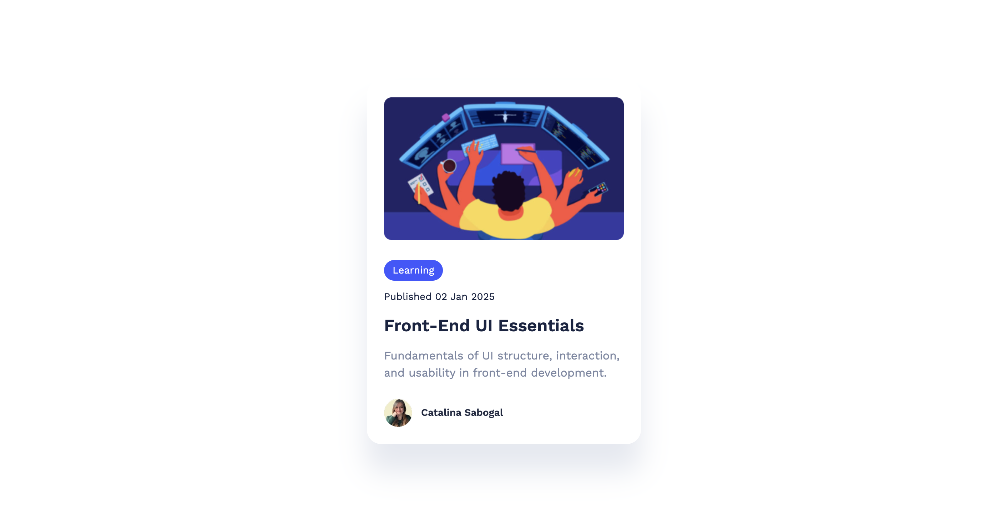

# 🚀 Dev Mode in Figma



## 📖 About

This project is a **fast-win development prototype** designed to explore **Figma's Dev Mode** and understand the transition from design to development.

It serves as a **learning experience** for front-end developers and designers who want to improve their workflow using Figma's Dev Mode.

This component serves as the base structure for a reusable card element in the project. It is designed to be flexible and customizable while maintaining consistency across the UI.

## 🔥 Features

- 🎨 **Prototype-driven development** using Figma Dev Mode.
- 💻 **Front-end setup** based on exported Figma components.
- 🔍 **Exploration of design-to-code workflows**.

## 📥 Installation & Usage

Since this is a static project with a focus on learning Figma Dev Mode, minimal setup is required.

### 1️⃣ Clone the Repository

```sh
git clone https://github.com/your-username/your-repository.git
cd your-repository
